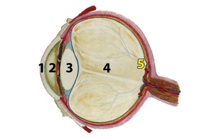

[Zpět na přehled](../README.md)

# 1 Optika oka

1. Rohovka
2. přední komora
3. vlastní čočka 
4. sklivec
5. Sítnice

**Zorný úhel:** Jedná se o úhel, pod kterým je možné pozorovat nebo zachytávat obraz, a to z daného bodu pohledu.

**Ohnisková vzdálenost vs zorný úhel**: Ohnisková vzdálenost objektivu má vliv na zorný úhel fotografie. Čím menší je ohnisková vzdálenost, tím širší bude zorný úhel.  
S objektivem s dlouhou ohniskovou vzdáleností získáte úzký zorný úhel a zaměříte se spíše na vzdálené objekty nebo detaily.

**Zorný uhel lidského oka je 208**

### Sítnice
**Tyčinky** citlivější na slabé světlo - poskytují pouze černobílé vídění - má me jich mohem více

**Čípky** méně citlivé na světlo - poskytují barevné vidění

**Žlutá skrvna** největší koncentrace čípků

#### Slepá skrvna
Je to oblast na sítnici oka, kde není žádná fotoreceptorová buňka (tyčinka nebo čípka). V tomto místě jsou spojeny nervové vlákna, která tvoří optický nerv a vedou signály z oka do mozku.

**Jasová adaptace oka** je schopnost oka přizpůsobit se různým úrovním osvětlení ve svém okolí.

## Purkyňův jev
Její tmavý jev (Purkyňův tmavý jev): Zvýšená viditelnost modré barvy při přechodu z jasného světla do tmy. - a snížená schopnost vidětenosti červené

Její světlý jev (Purkyňův světlý jev): Zvýšená viditelnost červené barvy při přechodu z tmy do jasného světla. - červená barva se stává jasnější

**Machovy proužky** dobře ilustrují, jak lidské vnímání kontrastu a jasu může být klamáno a jak mozek interpretuje okolní světlo a stíny.

**Spektrální citlivost lidského oka** Vlnová délka: 380nm až 780nm

**Relativní spektrální citlivost čípků** Každý čípek dokáže vidět pouze jednu barvu - nejvíce je červených pak zelených a nejméně červených

**Kontrast** kvantifikuje rodíl nebo podíl jasu mezi nejsvětlejším a nejtmavšími oblastmi v obrazu

**Kontrastní citlivost oka** lidské oko je schopno rozlišit 
v celém dynamickém rozsahu asi 50 úrovní změn jasu

**Prostorová rozlišovací schopnost oka** Prostorová rozlišovací schopnost oka se týká schopnosti rozlišit detaily ve vizuálním poli, zejména při pohledu na jemné struktury nebo malé objekty. - souvisí to s tím kolik informací dapadá na jednotlivý čípek nebo tyčinku - jednoduše řečeno čím blíže jsme tím detalnější obraz je

**Rozlišení** Kolik * kolik je pixelů na obrázku

**Časová rozlišovací schopnost oka** Oko při frevenci větší než 26 hz už vnímá objekt jako plynule se pohybující