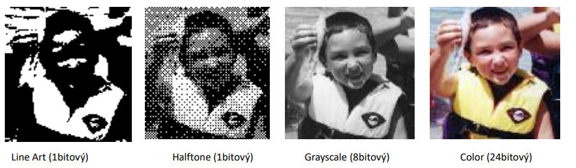
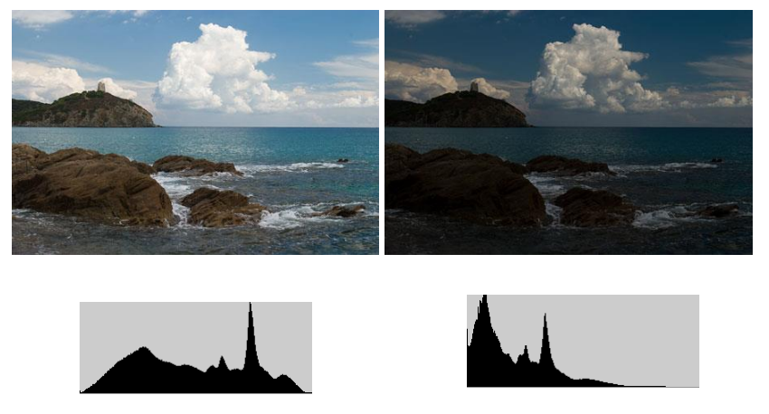

[Zpět na přehled](../README.md)

# 1. Půltónování a rozptylování
Lidské oko z určité vzdálenosti nerozliší černé a bílé body, ale vnímá jako odstín šedé

**Půltónování** - pixel původního obrazu převeden na matici bodů(dochází k zvětšení rozlišení) - Jsou dvě metody jedná která mění varianci šedi pomocí změny počtu černých teček v dané oblasti - a druhá mění se poloměr teček a tím měníme varianci šedi

**Rozpytlování** - pokud je nutné zobrazovat 1:1 (nedochází k tvětšení rozlišení obrazu) - Máme hodně variant napříkald maticový rozptyl udělají se matice velikostí které jsou od sebe pevně odděleny

## Snímací režim
Vlastnísnímaní může probíhat ve čtyřech různých režimech  
1. čárová grafika
2. Polotóny
3. šedotónový
4. Barevný

## Historgram
Kvantifikuje  **jasové poměry v obraze** - nenese informaci o jejich plošném rozložení  
Množství a frekvence barev v obrázku

