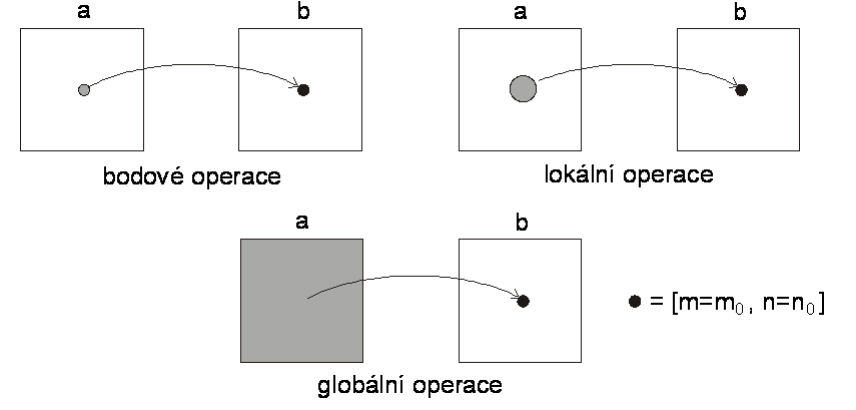
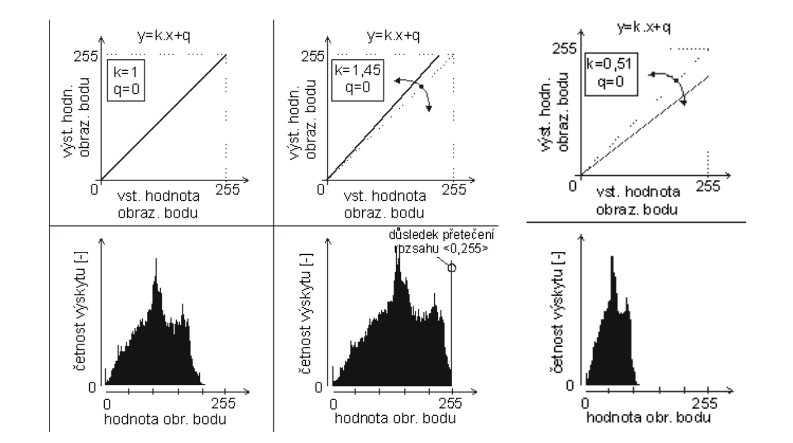
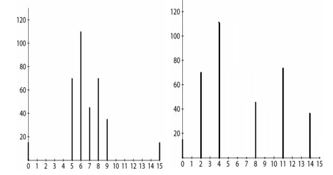
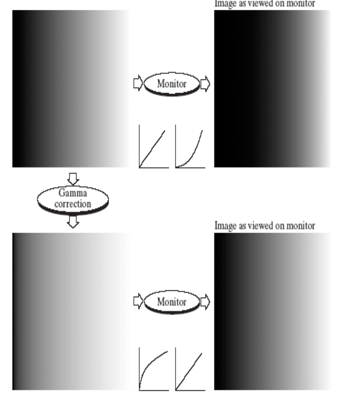
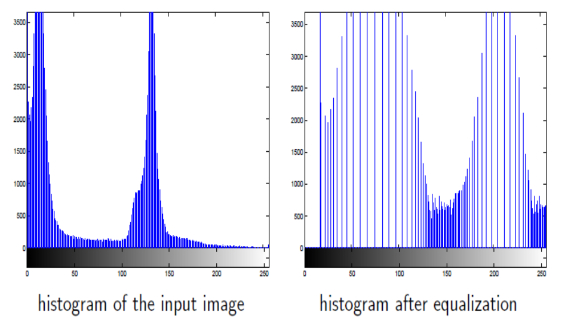
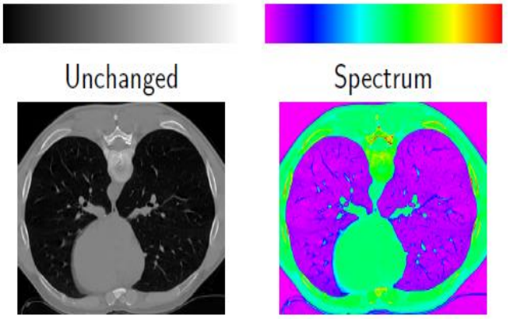

[Zpět na přehled](../README.md)

# 1. Typy operací nad obrazy

1. **Bodové operace** - výstupní hodnota pixwelu je závislá pouze na hodnotě pixelu v téže poloze ve stupním obrazu
2. **Lokální operace** - výstupní hodnota pixelu je závislá na hodnotách pixelů z definovaného okolí vstupního pixelu
3. **Globální operace** - výstupní hodnota pixelu je závislá na všech hodnotách pixelu ve vstupním obrazu

## Bodové operace 
**Modifikace jasu** - q představuje posun

**Modifikace kontrastu** - k představuje sklon

### Point Processing – Contrast enhancement
Jedná se o proces, při kterém se zesilují rozdíly v intenzitě mezi různými částmi obrazu.

### Point Processing – Gamma Correction
Gamma correction (gama korekce) je specifický druh Point Processingu, který se používá k úpravě jasu a kontrastu obrazu.

Dřívější obrazovky to měli tak že měli nějaký obraz ale přenesly ho příliš tmavý tak se u nich upravila gama aby byl obraz světlejší a pak když se to promítlo na displeji tak to mělo požadovaný jas a kontrast

### Point Processing – Logaritmická transformace jasu
Bodová operace s logaritmickou změnou jasu je konkrétní typ zpracování obrazu, který využívá logaritmických funkcí k úpravě hodnot jasu v jednotlivých pixelech obrazu. 

### Point Processing - Histogram Equalization
Cílem je zlepšit kontrast pro lepší zobrazení obrazu pro uživatele tím že využiju celé spektrum šedotónu.  

### Pseudocolor
Pseudocolor zobrazí šedotónový obrázek barevně pomocí toho že namapuje každou intenzitu na barvu pomocí tabulky nebo funkce

### Glovální práh
Jedná se o práh kdy se se vezmenou hodnoty do nějaké hranice a všechny se dají na nulovou hodnotu a zbylé se dají na maximální hodnotu - nepraktické

### Adaptivní práh
Při nerovnoměčném osvětliení - přizpůsobuje se lokálním podmínkám v obraze  
Dva přístupy
1. chow - kaneko příspu: Rozdělí obraz na překkrývající se oblasti a určuje se optimální práh pro každou oblast na základěš histogramu. - velice výpočetně náročné ale dostaneme nejlepší výsledek
2. Lokální prahování: z nejbižčšího okolí pixelu se pořítá průměr na základě čehož se počítá práh

### Bit-Plane Slicing („krájení bitů“)
Pokud máme 8 bitový obrázek jsem to schopni rozdělit na 8 rovin a poznáme to tak že každý pixel bude mít 8 bitovou hodnotu a tam kde je jednička tak v tém vrstvě je a kde není tak není. - Například nejvíc významné bity můžeou odhalit hrany a hrubčí struktury
