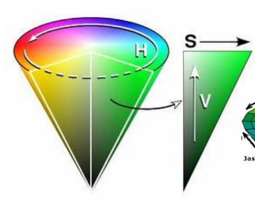
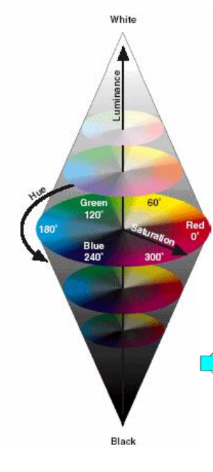

[Zpět na přehled](../README.md)
# 1. Barevná hluobka
Barevná hlobka je počet bitů použitých k popisu určité barvy nebo pixelu.

**Počet možných barev = 2barevná hloubka

## High/True Color
**High color**
- každý pixel je reprezentován třemi barvami v modelu RGB
- Každá barva se kóduje 16 bity - celkový počet varev je 216

**True color**
- každý pixerl je reprezentován třemi barvami v modelu RGB, každáý bbarva kódovaná 1 bytem

## Barevný model
Určuje, jakým způsobem se ze základních barev míchají do výsledné barvy

## Jak vidí zvířata
**Dichromatické vidění** - dvě barvy - pes  
**Trichromatické vidění** - tři barvy - člověk  
**Tetrachromatické vidění** - čtyři druhy čípků  - poslední vydí infačervené světlo - teplo - had

## Barevný model RGB
Aditivní model

## Barevný model CMY
Subtraktivní model  
Cyan(azurová) - Magenta(purpurová) - Yellow

### Vztah mezi CMY - RGB
C = 1 – R  
M = 1 – G  
Y = 1 – B  

### Prostor CMYK
K = černá

Používá se v tiskárnách - v teorii by měla vznikount smícháním CMY černá v praxi ovšem vznikne tmavě hněho-šedivá  
A hlavně se to používá z ekonomických důvodů

Určitou část spektra není schopno CMYK zobrazit

## Model HSV
Model orientovaný na uživatele - intuitivní fyzikální veličiny

**Hue - barevný tón (0° až 360°)** 

**Saturation - sytost barvy (0-1)** 

**Value - hodnota jasu (0-1)** 

## Model HLS
Snaží se eliminovat nedostatky modelu HSL (nesymetrii z hlediska jasu).   
Skládá se z:
- **Hue** – barevný tón (0-360o
)
- **Lightness** – světlost (0-1) 0-bílá, 1-černá
- **Saturation** – sytost (0-1) 0=osa, 1=povrch

## Chromatický diagram:
Chromatický diagram je grafické znázornění vztahů mezi barvami v barevném spektru.  
Diagram zobrazuje všechny viditelné barvy lidského oka a je obvykle tvaru kruhu nebo trojúhelníku. Barvy jsou reprezentovány souřadnicemi v diagramu.

## Gamut:
Gamut se týká rozsahu barev, které může určité zařízení nebo barevný model reprodukovat. Může být definován jako omezený prostor barev, které jsou dostupné v daném systému nebo zařízení.