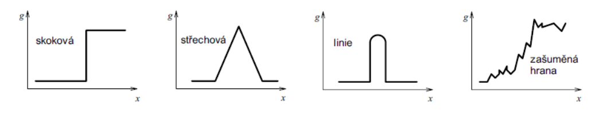

[Zpět na přehled](../README.md)

# 1. Typy operací nad obrazy - lokální operace

## Gaussovský šum
Gaussovský šum je druh šumu, který má normální rozdělení pravděpodobnosti. To znamená, že hodnoty šumu mají tendenci se shromažďovat kolem určité střední hodnoty s vyšší pravděpodobností, a čím dále od střední hodnoty, tím je pravděpodobnost nižší.  
Představme si, že máme černobílý obrázek a každý pixel má svou intenzitu. Přidání Gaussovského šumu k obrázku znamená přičíst ke každému pixelu hodnotu, která je náhodně vybrána z normálního rozdělení 

## Potlačení aditivního šumu
Hlavním úkolem je snížení rozptylu šumu
Algoritmy založeny na průměrování
- Průměrování série obrazů
    - `n` obrázků položených na sebe
- Průměrování sousedních pixelů
    - Nová hodnota se vypočítá jako lineární kombinace hodnot obrazové funkce v okolí.

Změna velikosti okolí průměrování - problémy na okraji obrazu

## Konvoluční maska
Konvoluční maska (nebo také konvoluční jádro) je malá matice hodnot, která se používá při operaci konvoluce v rámci konvolučních neuronových sítí (CNN) nebo v obecnějším smyslu při zpracování obrazových dat. Tato operace je klíčovým prvkem v konvolučních sítích, které jsou často používány pro zpracování obrazových a prostorových dat.

Při procházení touto maskou přes obraz se v každém kroku provede vážená suma devíti hodnot pod maskou, a výsledek se zapíše do odpovídající pozice v nové feature mapě. Tento proces pomáhá extrahovat různé rysy nebo vzory z obrazu.

## 2D Gaussovský filtr
2D Gaussovský filtr je konvoluční maska používaná pro hladké rozostření nebo redukci šumu v obrazech. 

## Impulsní šum (typu sůl a pepř)
Impulsní šum, známý také jako "sůl a pepř", je druh šumu v digitálních obrazech, kde náhodně některé pixely přijmou extrémně vysoké nebo nízké hodnoty, což vede k vzhledu, jako by byly posypané sůlí nebo pepřem. Tento typ šumu může vzniknout v důsledku různých faktorů, jako jsou chyby při přenosu dat, poškození senzoru fotoaparátu nebo vadné body v digitálním zařízení.

## Filtrace mediánem
Vhodné pro šum sůl a pepř
Výpočet mediánu je pro diskrétní obrazovou funkci jednoduchý. 
Stačí uspořádat vzestupně hodnoty jasu v lokálním okolí a medián určit jako 
prvek, který je uprostřed této posloupnosti.

Jeho hlavní nevýhodou je že v obdélnikovém okolá je to, že porušuje tentké čáry a ostré rohy v obraze

## Filtrace metodou rotující masky
**Cíl:** Omezit rozmazávání hran při průměrování

Rotující maska 3 × 3 má celkem 9 možných poloh, 1 uprostřed + 8 ve všech možných polohách.

Z masek se vybere ta, kde má jas nejmenší rozptyl a použije se pro odhad 
hodnoty obrazové funkce v reprezentativním bodu.

## Detekce hran
Místa v obraze odpovídající **významným hranám** nesou více informace než jiná místa v obraze

Hrany jsou invariantní (nemení se) vůči změně osvětlení a místa podhledu  
Detekce hran má časté použití v rozpoznání obsahu obrazu

### Původ hran v obraze
Hrany vznikají dáky nespojistotem v normále k povrchu, hloubce, odrazivosti povrchu. odleskům nebo nespojistostech v osvětlení

### Typické jasové profily v okolí hranových bodů

- První tři profily zleva, tj. skoková hrana, střechová hrana, 
tenká linie, jsou idealizované.  
- Poslední profil odpovídá zašuměné hraně, kterou lze najít v 
reálném obrázku.

**Hrana** v kontextu zpracování obrazu je oblast na obrázku, kde dochází k prudké změně intenzity světla mezi sousedními pixely.

**Hranový bod** je konkrétní pixel, kde se rychle mění jas nebo barva

**Hranice:** může být vnímána jako obrys nebo ohraničení mezi dvěma odlišnými částmi nebo objekty. Tento termín má obvykle širší význam než pouhé identifikování prudkých změn intenzity.

### Hranové detektory
1. hledání maxim prvních derivací 
2. hledání průchodu druhých derivací nulou

## Diskrétní aproximace
Diskrétní aproximace derivace se používá k odhadu derivací funkce v diskrétních bodech. V kontextu zpracování obrazu nebo signálů se často pracuje s diskrétními daty, a proto je důležité znát metody pro aproximaci derivací v diskrétním prostoru.

Tyto metody jsou obvykle používány v digitální analýze obrazu nebo zpracování signálů, kde máme diskrétní soubory hodnot naměřených nebo získaných z obrazu nebo signálu. Důležité je volit vhodný typ aproximace derivace v závislosti na konkrétním úkolu a charakteristikách dat.