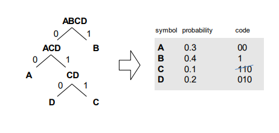

[Zpět na přehled](../README.md)

# 1. Zrakový orgán(Dynamický rozsah, Spektrální citlivost)
**Dynamický rozsah:** Dynamický rozsah je schopnost oka rozlišovat mezi nejsvětlejšími a nejtmavšími oblastmi scény.

**Spektrální citlivost:** Spektrální citlivost popisuje, jak různé části viditelného světla ovlivňují vnímání oka.

# 2. Jasová citlivost oka
Jasová citlivost oka se týká schopnosti oka adaptovat se na různé úrovně osvětlení ve svém okolí.  
Oko má dvě hlavní formy vnímání světla. - když je světlo a když je tma.  
Při snižování úrovně osvětlení se zornice rozšiřuje, což umožňuje více světla dopadnout na sítnici a zlepšuje scotopické vidění.

# 3. Kontrastní citlivost oka
Kontrastní citlivost oka odkazuje na schopnost rozlišovat rozdíly v jasu mezi různými částmi obrazu nebo scény.  
Kontrastní citlivost je zejména spojena s čípkovými buňkami na sítnici, které jsou odpovědné za vnímání barev a detailů.

# 4. Machův pásmový jev
Machův pásmový jev je optický iluzorní jev, který vzniká v důsledku kontrastu mezi sousedními oblastmi s různým jasem.  
Oko je schopno adaptovat se na různé úrovně jasu a kontrastu. Machův pásmový jev může být ovlivněn adaptací oka na předchozí podněty, což mění vnímání jasu a kontrastu.

# 5. Prostorová rozlišovací schopnost oka
Prostorová rozlišovací schopnost oka se týká schopnosti vnímat a rozlišovat detaily ve vizuálním poli  
Prostorová rozlišovací schopnost je často ovlivněna vzdáleností od pozorovaného objektu. Na větší vzdálenosti se naše oči mohou stále vnímat celkový obraz, ale detaily mohou být obtížnější rozlišit.

# 6. Časová rozlišovací schopnost oka
Časová rozlišovací schopnost oka se týká schopnosti vnímat a rozlišovat změny ve světelných podnětech v čase, zejména v kontextu rychlých událostí nebo pohybujících se objektů.  


# 7. Obecné schéma procesu zobrazení

1. **Záznam světelných podnětů:**
   - Proces začíná sběrem světelných podnětů ze scény, kterou chceme zobrazit. Světlo se odráží od povrchů objektů a vstupuje do oka nebo kamery.

2. **Zrakový systém (v případě oka):**
   - Ve fázi zrakového systému je světlo upravováno rohovkou a čočkou oka, aby se zaostřilo na sítnici, která obsahuje fotoreceptory (čípky a tyčinky).

3. **Konverze na nervové signály:**
   - Fotoreceptory na sítnici reagují na světlo a generují nervové signály. Čípky jsou odpovědné za barevné vnímání, zatímco tyčinky jsou citlivější na nízké úrovně osvětlení.

4. **Přenos nervových signálů:**
   - Nervové signály jsou přenášeny optickým nervem a dalšími nervovými dráhami směrem k vizuální kůře v mozku.

5. **Zpracování v mozku:**
   - V mozku probíhá složitý proces zpracování vizuálních informací. Dochází k analýze tvarů, barev, hloubky a pohybu. Různé části mozku jsou zapojeny do různých aspektů vizuálního vnímání.

6. **Vytvoření vnímání:**
   - Na základě zpracovaných informací v mozku vzniká vnímání obrazu nebo scény. V tomto okamžiku dochází k subjektivnímu vnímání a interpretaci vizuálních podnětů.


# 8. Základní principy sběru obrazových dat

1. **Snímání scény:**
   - Proces začíná snímáním scény pomocí zařízení, jako jsou kamery, fotografické aparáty nebo jiná optická zařízení. Světlo se odráží nebo emituje z objektů a vstupuje do optického systému snímacího zařízení.

2. **Optická soustava:**
   - Optická soustava zařízení slouží k zaostření světla na snímací prvek (senzor). To může zahrnovat čočky, zrcadla a další optické prvky, které ovlivňují vlastnosti snímaného obrazu.

3. **Sensory a snímače:**
   - Světelné podněty jsou zachycovány senzory nebo snímači. V případě digitálních kamer jsou to obvykle fotosenzory, které převádějí světelné signály na elektrické signály.

4. **Převod na elektrické signály:**
   - Fotosenzory přeměňují světelné podněty na elektrické signály. V případě digitálních kamer jsou to často CCD (Charge-Coupled Device) nebo CMOS (Complementary Metal-Oxide-Semiconductor) senzory.

5. **Záznam dat:**
   - Elektrické signály, které odpovídají světelným informacím, jsou zaznamenány a digitalizovány. To vytváří digitální obraz, který může být dále zpracován a uchován.


# 9. Vrozkování a kvantizace obrazu
**Vzorkování:** se týká procesu sběru vzorků (čištění) hodnot světelnosti z původního analogového obrazu v pravidelných intervalech.
- Princip: Při vzorkování jsou získávány hodnoty jasu nebo barvy v diskrétních bodech na obrazové ploše. Tento proces umožňuje převod kontinuálních hodnot do diskrétní formy, což je klíčové pro digitální zpracování obrazu.

**Aby nedošlo k aliasingu (zkreslení), frekvence vzorkování musí být alespoň dvojnásobkem nejvyšší frekvence v signálu.**

Vyšší vzorkovací frekvence vede na lepší rozlišení

**Kvantizace:** Kvantizace je proces, při němž jsou diskrétním hodnotám přiřazeny specifické hodnoty ze stanoveného souboru možných hodnot.

**Bitová hloubka:** Vztah k kvantizaci: Bitová hloubka určuje, kolik bitů je použito pro reprezentaci jednoho pixelu. Čím vyšší bitová hloubka, tím více možných hodnot může být přiřazeno každému pixelu

# 10. Lineární zobrazovací systém
Lineární zobrazovací systém se v oblasti zpracování obrazu odkazuje na takový systém, který má lineární vztah mezi vstupními a výstupními daty. To znamená, že změna na vstupu je přímo proporcionální k odpovídající změně na výstupu.
V kontextu zobrazování obrazových dat může lineární zobrazovací systém například reprezentovat lineární transformaci nebo filtr, který přenáší informace z vstupního obrazu na výstupní obraz.

**Homogenita:** Násobení vstupního signálu konstantou způsobí násobení výstupu stejnou konstantou.

# 11. Filtrační (výběrová, resp. vzorkovací) vlastnost Diracova impulzu
Diracův impuls, často označovaný jako δ(t), je teoretická funkce, která má nulovou hodnotu pro všechny t ≠ 0 a nekonečně velkou hodnotu pro t = 0. Má významný vliv v teorii signálů a systémů, zejména při popisu impulsní odezvy lineárních systémů.
V praxi to znamená, že výstupní odezva systému na Diracův impuls je rovna impulsní odezvě systému. Tato vlastnost je klíčová pro analýzu a návrh systémů, protože umožňuje odhadovat, jak se systém bude chovat na libovolný vstupní signál, rozložený do lineární kombinace Diracových impulsů.
Vzorkovací vlastnost Diracova impulzu je také důležitá v kontextu vzorkování signálů. Diracův impuls může být použit k modelování ideálního vzorkování signálů, což je klíčový prvek v digitálním zpracování signálů.

# 12. Ideální lineární proces zobrazení
Ideální lineární proces zobrazení je koncept v teorii signálů a systémů, který popisuje ideální situaci, kdy lineární systém přenáší vstupní signál na výstupní signál bez zkreslení nebo přidání šumu.
V reálném světě je slovo "ideální" klíčové. Skutečné fyzické systémy často nesplňují všechny tyto ideální vlastnosti kvůli omezením a nežádoucím faktorům, jako jsou šumy, ztráty nebo neidealita komponent. Nicméně, používání ideálního modelu pomáhá v analýze a návrhu systémů a usnadňuje porozumění základních principů.

# 13. Prosrtorově invariantní systém
Prostorově invariantní systém (také označovaný jako posunutelný nebo posunově invariantní) je koncept v oblasti zpracování obrazu a signálů, který popisuje systémy nebo operace, jejichž vlastnosti zůstávají neměnné (invariantní) při posunutí vstupního signálu nebo obrazu v prostoru (často v jedné nebo dvou dimenzích).
Homogenita (Posunutí vstupu): Posunutí vstupu (signálu nebo obrazu) se projevuje stejným posunutím na výstupu.
Časová nebo prostorová nezávislost: Vlastnosti systému jsou konstantní a nezávislé na čase nebo prostoru.

Příklady prostorově invariantních systémů zahrnují různé filtry, konvoluce v digitálním zpracování obrazu, a vůbec většinu lineárních systémů používaných v oblasti signálů a obrazového zpracování.

# 14. Konvoluce ve spojité a diskrétní oblasti
Konvoluce je matematická operace, která kombinuje dvě funkce, aby vytvořila třetí. V kontextu zpracování obrazu a signálů se konvoluce často používá k transformaci vstupního signálu nebo obrazu pomocí jiného signálu, známého jako konvoluční jádro nebo maska.  

**Konvoluční jádro nebo maska** je matice (v diskrétní oblasti) nebo funkce (ve spojité oblasti), která se používá k provedení konvoluce. Jedná se o soubor vah, které specifikují, jak jsou jednotlivé hodnoty vstupního signálu váženy při vytváření výstupního signálu.

**Spojitá konvoluce:** Představte si, že máte signál, což může být jakýkoliv průběh hodnot v závislosti na čase (nebo jiné proměnné). Spočítat spojitou konvoluci znamená vzít jeden signál a "projet" ho druhým. Pro každý okamžik v čase se podíváte, jak se oba signály vzájemně ovlivňují. - jako konvoluční masku využíváme funkci

**Diskrétní konvoluce:** V případě diskrétní konvoluce pracujeme s daty, která jsou vzorkována v diskrétních bodech. Místo toho, abychom integrovali přes nekonečný čas, projdeme všechny možné kombinace hodnot vstupního signálu a impulzní odezvy. - jako konvoluční masku využíváme matici

# 15. Korelace vs konvoluce
**Korelace vs. Konvoluce:**

**1. Korelace:**
   - **Definice:** Korelace je matematická operace, která měří podobnost mezi dvěma signály. V rámci signálů se obvykle používá k určení, jak se jeden signál podobá druhému a na jakém časovém nebo prostorovém posunu jsou.

   - **Aplikace:**
      - V oblasti zpracování obrazu: Pomáhá najít podobnosti mezi různými oblastmi obrazu.
      - V komunikačních systémech: Používá se pro synchronizaci signálů.

   - **Příklad:**
      - Představte si dvě oblasti v obraze a aplikujte korelaci. Výsledek bude ukazovat, jak se tyto oblasti podobají a na jakém prostorovém posunu jsou.

**2. Konvoluce:**
   - **Definice:** Konvoluce je matematická operace, která kombinuje dva signály, často za účelem vytvoření třetího signálu. V kontextu zpracování signálů může být použita k určení odezvy systému na vstupní signál.

   - **Aplikace:**
      - V teorii signálů: Slouží k modelování lineárních a invariantních systémů.
      - V zpracování obrazu: Konvoluce se často používá pro různé filtrační operace, jako je detekce hran nebo rozmazání.

   - **Příklad:**
      - Aplikujte konvoluci mezi impulsní odezvou systému a vstupním signálem. Výsledný signál bude ukazovat, jakým způsobem systém reaguje na vstup.

**Hlavní rozdíly:**
- **Odezva:**
   - Korelace měří podobnost.
   - Konvoluce kombinuje dva signály pro vytvoření třetího.

- **Symetrie:**
   - Korelace nemá nutně symetrii vůči posunutí.
   - Konvoluce má symetrii vůči posunutí (lineární a invariantní systém).

- **Příznak:**
   - Korelace vrací výsledek s informacemi o podobnosti.
   - Konvoluce se často používá pro modelování systémové odezvy.

# 16. Barevná hloubka
Barevná hlobka je počet bitů použitých k popisu určité barvy nebo pixelu.  
**Počet možných barev = 2<sup>barevná hloubka</sup>**

# 17. High color, true color
High Color a True Color jsou označení pro formáty barevné hloubky v digitálních obrazech  

**High color**
- každý pixel je reprezentován třemi barvami v modelu RGB
- Každá barva se kóduje 16 bity - celkový počet varev je 2<sup>16</sup>

**True color**
- každý pixel je reprezentován třemi barvami v modelu RGB, každá barevná složka kódovaná 1 bytem - celkový počet varev je 2<sup>24</sup>


# 18. Barevný model RGB(A)
**Rozšíření RGB o Alfa Kanál:**  
Alfa Kanál: Model RGBA rozšiřuje RGB o čtvrtý kanál zvaný alfa kanál (Alpha). Alfa kanál určuje průhlednost pixelu.
Bitová Hloubka: Alfa kanál má svou vlastní bitovou hloubku a může být vyjádřen jako hodnota mezi 0 (úplně průhledný) a 1 (úplně neprůhledný).  
**Použití:** RGBA je běžně používáno pro práci s průhledností, jako například při overlaying grafiky nebo při tvorbě průhledných oblastí na obrazu.  
Výhoda: Umožňuje vrstvení obrázků nebo grafiky s průhledností.

# 19. CMY(K) - subtraktivní model
Subtraktivní model  
Cyan(azurová) - Magenta(purpurová) - Yellow

**Vztah mezi CMY - RGB**
C = 1 – R  
M = 1 – G  
Y = 1 – B  

**Prostor CMYK**
K = černá

Používá se v tiskárnách - v teorii by měla vznikount smícháním CMY černá v praxi ovšem vznikne tmavě hněho-šedivá  
A hlavně se to používá z ekonomických důvodů

Určitou část spektra není schopno CMYK zobrazit

# 20. Barevný model HSV a HLS
**Model HSV**
Model orientovaný na uživatele - intuitivní fyzikální veličiny
- Hue - barevný tón (0° až 360°)
- Saturation - sytost barvy (0-1)
- Value - hodnota jasu (0-1)

**Model HLS**
Snaží se eliminovat nedostatky modelu HSL (nesymetrii z hlediska jasu).
Skládá se z:
- Hue – barevný tón (0-360o )
- Lightness – světlost (0-1) 0-bílá, 1-černá
- Saturation – sytost (0-1) 0=osa, 1=povrch

# 21. Chromatický diagram, Gamut
**Chromatický diagram** je grafické znázornění vztahů mezi barvami v barevném spektru.
Diagram zobrazuje všechny viditelné barvy lidského oka a je obvykle tvaru kruhu nebo trojúhelníku. Barvy jsou reprezentovány souřadnicemi v diagramu.

**Gamut** se týká rozsahu barev, které může určité zařízení nebo barevný model reprodukovat. Může být definován jako omezený prostor barev, které jsou dostupné v daném systému nebo zařízení.

# 22. Půltónování a rozptylování
**Půltónování** - pixel původního obrazu převeden na matici bodů(dochází k zvětšení rozlišení) - Jsou dvě metody jedná která mění varianci šedi pomocí změny počtu černých teček v dané oblasti - a druhá mění se poloměr teček a tím měníme varianci šedi

**Rozpytlování** - pokud je nutné zobrazovat 1:1 (nedochází k tvětšení rozlišení obrazu) - Máme hodně variant napříkald maticový rozptyl udělají se matice velikostí které jsou od sebe pevně odděleny - V digitálním zpracování obrazu se rozptylování může používat k rozmazání hrany nebo detailu obrazu, což může vytvářet efekt jemnějších přechodů mezi barvami nebo jasovými hladinami.

# 23. Histogram
Histogram je grafické zobrazení frekvence intenzit světla v obraze. Pro každý odstín barvy nebo intenzitu šedé na ose x histogramu je na ose y uveden počet pixelů s touto konkrétní hodnotou intenzity.  

**Práhování:** Určení vhodné hodnoty prahu pro segmentaci obrazu. Práhování umožňuje rozdělit obraz na různé oblasti na základě intenzit pixelů.

- Jednoduchý histogram
- RGB histogram
- komulativní histogram

# 24. Bodové, lokální a globální operace nad obrazy
Otázka: Jaký je rozdíl mezi bodovými, lokálními a globálními operacemi nad obrazy?

Odpověď:

1. **Bodové operace nad obrazy:**
   - **Princip:** Bodové operace pracují s každým pixelem obrazu nezávisle na ostatních pixelech.
   - **Příklad:** Zvýšení kontrastu nebo změna jasu každého pixelu o konstantní hodnotu.

2. **Lokální operace nad obrazy:**
   - **Princip:** Lokální operace se vztahují k okolí každého pixelu. Namísto toho, aby byly pixely zpracovávány nezávisle, jsou ovlivněny hodnotami sousedních pixelů.
   - **Příklad:** Filtry pro rozmazání nebo ostření obrazu, které využívají hodnoty pixelů v okolí daného pixelu.

3. **Globální operace nad obrazy:**
   - **Princip:** Globální operace pracují s celým obrazem jako jedním celkem. Každý pixel je ovlivněn hodnotami v celém obraze.
   - **Příklad:** Globální úpravy kontrastu, změny odstínu celého obrazu, nebo úpravy jasu bez ohledu na lokální struktury.

Celkově lze říci, že bodové operace jsou jednoduché a nezávislé na kontextu okolních pixelů. Lokální operace berou v úvahu okolí každého pixelu a jsou vhodné pro zpracování detailů a struktury. Naopak globální operace pracují s celým obrazem a jsou efektivní pro celkové úpravy obrazu, které nemají být specifické vzhledem k určité oblasti.

# 25. Modifikace jasu a kontrastu
`y = k*x + q` => k = sklon, q = pousun

Máme takovej ten graf a podle toho jak se tam pohybuje čára tak se to mění

# 26. Globální a adaptivní prahování
**Globální prahování:** používá jediný práh (threshold), který se aplikuje na celý obraz. Všechny pixely s intenzitou nižší než práh jsou považovány za černé, a ty s vyšší intenzitou za bílé (nebo naopak, v závislosti na volbě zobrazení).

**Adaptivní prahování:** využívá lokálních informací o intenzitách v oblasti kolem každého pixelu. Namísto jednoho globálního prahu je každý pixel prahován na základě hodnot v jeho okolí. Tato metoda může být efektivnější, protože umožňuje adaptaci k lokálním vlastnostem obrazu.

# 27. Logaritmická tranformace jasu
Logaritmická transformace jasu je technika, která se používá k modifikaci jasu pixelů v obraze pomocí logaritmické funkce. Tato transformace je často využívána k zdůraznění detailů v tmavých oblastech obrazu, což může být užitečné v případech, kdy je většina informací obsažena ve stínech.

# 28. Gamma korekce
Gamma korekce (také známá jako gama úprava) je technika používaná ke změně vztahu mezi hodnotami intenzity pixelů v obrazu a intenzitou světla emitovaného nebo zaznamenaného zařízením. Gamma korekce je matematická úprava, která není lineární a umožňuje upravit jas obrazu tak, aby byl více konzistentní s lidským vnímáním světla.  
Gama korekce může také ovlivnit kontrast v obraze. Úpravou gama hodnoty lze dosáhnout lepší kontroly nad kontrastem a detaily v obraze.

# 29. Ekvalizace histogramu (globální, lokální)
Ekvalizace histogramu je technika v oblasti zpracování obrazu, která se používá k optimalizaci distribuce intenzit pixelů v obraze. Cílem je dosáhnout rovnoměrnějšího rozložení intenzit, což často vede ke zvýšení kontrastu a zlepšení vizuální kvality obrazu.

**Glovální ekvalizace** - Celkový histogram obrazu je zpracován tak, aby byla dosažena rovnoměrná distribuce intenzit.

**Lokální ekvalizace histogramu** - Podobně jako globální ekvalizace, ale aplikuje se lokálně na menší oblasti obrazu. To umožňuje zachovat detaily a kontrast v různých částech obrazu.

# 30. Mediánová filtrace
Mediánová filtrace je jedním z postupů zpracování obrazu, který se často používá k redukci šumu a hladkosti obrazu. Princip spočívá v nahrazení hodnoty každého pixelu mediánem hodnot v jeho okolí. Tato metoda je účinná zejména při odstranění impulzního šumu, který může vzniknout například při digitálním přenosu obrazu nebo při použití nesprávného zařízení.

# 31. Vyhlazovací filtry
Vyhlazovací filtry jsou techniky zpracování obrazu, které slouží k redukci detailů a odstranění šumu v obrazech. Tyto filtry mají za cíl vytvořit hladší verzi obrazu tím, že snižují nebo eliminují vysoké frekvence nežádoucího šumu nebo detailů.

**Průměrovací filtr (Mean Filter):**
- Princip: Každý pixel v obraze je nahrazen průměrnou hodnotou jeho okolí.
- Použití: Efektivní pro odstranění šumu, ale může způsobit ztrátu detailů.

**Gaussovský filtr (Gaussian Filter):**
- Princip: Hodnota každého pixelu je váženým průměrem hodnot v jeho okolí, přičemž váhy jsou odvozeny z Gaussova rozložení.
- Použití: Poskytuje vyhlazení s postupným přechodem, vhodný pro odstranění šumu a zachování detailů.

**Mediánový filtr (Median Filter):**
- Princip: Hodnota každého pixelu je nahrazena mediánem hodnot v jeho okolí.
- Použití: Efektivní při odstranění impulsního šumu a zachování ostrých hran.

# 32. Hrana, hranový bod, Původ hran v obraze
**Hrana** v obraze označuje oblast, kde dochází k prudké změně intenzity nebo barvy pixelů.

**Hranový bod** je konkrétní bod na obraze, kde dochází k prudké změně intenzity nebo kontrastu.

**Původ hran v obraze** - hrany vznikají díky nespojitostem v normále k povrchu, hloubce, odrazivosti povrchu. odleskům nebo nespojitostech v osvětlení

# 33. Kategorie hranových detektorů
Hranové detektory jsou algoritmy používané v oblasti zpracování obrazu ke zvýraznění či identifikaci hran v obrazech.

# 34. Detektory založené na hledání maxim prvních derivací
Detektory hran založené na hledání maxim prvních derivací jsou často nazývány gradientními detektory. Tyto detektory se zaměřují na analýzu prvních derivací intenzity pixelů v obraze a identifikují místa, kde dochází k prudkým změnám intenzity, což indikuje přítomnost hran.

**Sobelův operátor:** Používá konvoluci s jednoduchými maskami k aproximaci prvních derivací intenzity v horizontálním a vertikálním směru.
Detekce: Lokalizuje hrany ve směrech, které jsou kolmé na sebe.

**Robertsův operátor:** Využívá jednoduché konvoluční jádro k aproximaci prvních derivací intenzity v obou diagonálních směrech.
Detekce: Zaměřuje se na diagonální hrany.


# 35. Detektory založaené na hledání průcohodu druhých derivací nulou
Detektory založené na hledání průchodu druhých derivací nulou jsou používány při analýze obrazových dat k identifikaci hran a změn intenzity. Princip spočívá ve vyhledávání míst na obrazu, kde dochází k prudké změně intenzity, což může naznačovat přítomnost hran nebo detailů.

# 36. Ošetření Laplaciánem
Ošetření Laplaciánem je proces, kde se na obrazu používá Laplaceův operátor pro zdůraznění změn v intenzitě a detekci hrany nebo struktur.

**Předzpracování:**
- Před aplikací Laplaceova operátoru se často provádí předzpracování obrazu, například pomocí filtrů pro redukci šumu nebo aplikace Gaussova filtru pro rozostření.

**Aplikace Laplaceova operátoru:**
- Laplaceův operátor se aplikuje na předzpracovaný obraz pomocí konvoluce. Konkrétní jádro pro Laplaceův operátor bylo uvedeno v předchozí odpovědi.

**Zvýraznění změn:**
- Výsledek konvoluce s Laplaceovým operátorem zvýrazní oblasti s prudkými změnami intenzity, což může být interpretováno jako hrany nebo detaily.

**Práhování:**
- Pro lepší vizualizaci a detekci hran se často aplikuje prahování. Prahování může oddělit oblasti s výraznými změnami od pozadí.

# 37. LoG operátor
Laplacián je velice citlivý na šum

LoG operátor, což znamená Laplacian of Gaussian, je technika používaná v oblasti zpracování obrazu pro detekci hran a detailů. Tato technika kombinuje dva klíčové kroky: Gaussovský filtr a Laplaceův operátor.

**Gaussovský filtr:**
- Začneme aplikací Gaussova filtru na obraz. Gaussovský filtr slouží k rozmazání obrazu a redukci šumu.
Gaussovský filtr má jádro, které se používá k vážené konvoluci s obrazem. Rozmazání obrazu pomáhá snížit vliv šumu a zjemnit přechody v intenzitě.

**Laplaceův operátor:**
- Poté se aplikuje Laplaceův operátor na obraz po předchozím rozmazání Gaussovským filtrem.
Laplaceův operátor slouží k detekci prudkých změn v intenzitě, což může indikovat hrany nebo detaily na obrazu.

**LoG operátor:**
- Kombinujeme tyto dva kroky tím, že aplikujeme Laplaceův operátor na Gaussovsky vyhlazený obraz.
Tím získáme obraz, ve kterém jsou hrany a detaily výrazněji zvýrazněny, a zároveň jsou potlačeny šumy.

# 38. DoG jako aproximace Log
DoG (Difference of Gaussians) a LoG (Laplacian of Gaussian) jsou dvě příbuzné techniky používané v oblasti zpracování obrazu pro detekci hran a detailů. DoG může být chápán jako aproximace LoG a je často používán kvůli výpočetní efektivitě.

**DoG** je metoda, která spočívá v odčítání dvou Gaussovských rozmazání obrazu s různými hodnotami rozptylu (sigma). Tato operace vytváří obraz, ve kterém jsou výrazně zvýrazněny hrany a detaily.

# 39. Odstranění nevýznamných hranových bodů
Odstranění nevýznamných hranových bodů se často provádí s cílem zachovat pouze ty hrany, které jsou důležité nebo významné pro daný úkol.

**Práhování:** 
- Použití prahování je jednou z nejjednodušších metod. Tím, že nastavíme určitý prah intenzity, můžeme odstranit hrany s nižší intenzitou, které jsou pravděpodobně šum nebo nevýznamné. - poté je ještě vylepšené prahování kde je práh ze zdola i shora

**Klastrování:**
- Klastrování pixelů na základě jejich vlastností, jako je intenzita nebo barva, může odstranit nevýznamné hrany. 

# 40. Fourierova transformace (DFT jednoduchých obrazců)
Fourierova transformace mění …data… z 
časové oblasti do frekvenční oblasti a zpět.  
Tato transformace umožňuje analýzu frekvenčních složek obrazu nebo signálu.

# 41. Filtrace ve frekvenční oblasti
Filtrace ve frekvenční oblasti je technika zpracování obrazu, která pracuje s obrazem nebo signálem ve frekvenční doméně. Hlavním nástrojem pro filtrace ve frekvenční oblasti je Fourierova transformace, která umožňuje převod obrazu ze současné prostorové domény na frekvenční doménu a zpět.

**Převod do frekvenční oblasti:**
- Používá se Fourierova transformace (nejčastěji diskrétní Fourierova transformace - DFT) k převodu obrazu nebo signálu z prostorové do frekvenční domény. Tímto krokem získáme reprezentaci obrazu v termínech frekvencí.

**Filtrace v frekvenční oblasti:**
- V frekvenční doméně můžeme aplikovat filtry nebo manipulovat s frekvenčními složkami obrazu.
Nízkoprůchodový filtr ponechá nízké frekvence a potlačí vysoké frekvence, zatímco vysokoprůchodový filtr funguje opačně. Obraz po aplikaci nízkoprůchodového filtru bude obsahovat hlavně nízkofrekvenční složky.
Obecněji se mohou používat i jiné filtry nebo metody pro úpravu frekvenční reprezentace obrazu podle konkrétních požadavků.

**Inverzní transformace:**
- Po provedení požadovaných operací ve frekvenční doméně se provede inverzní Fourierova transformace (IDFT) k převedení obrazu zpět do prostorové domény.

**Filtr dolní propust (Low-pass filter):**
- Umožňuje průchod nízkým frekvencím a potlačuje vysoké frekvence. Často se používá pro redukci šumu nebo vyhlazování obrazu.  

**Filtr horní propust (High-pass filter):**
- Přenáší vysoké frekvence a potlačuje nízké frekvence. Může být využíván pro detekci hran nebo odstranění nízkofrekvenčního šumu.

# 42. Komprese obrazů (Redundance a irelevance)
Komprese obrazů je proces snižování množství dat potřebných k reprezentaci obrazu s minimálním úbytkem kvality. 

**Redundance:** Prázdný prostor: Mnoho obrazů obsahuje oblasti s jednolitou barvou nebo malým množstvím detailů. Kompresní algoritmy mohou využít redundanci v těchto oblastech tím, že ukládají pouze informace o změnách v barvě nebo intenzitě.

**Irelevance:** Nepodstatné informace: Některé informace v obraze mohou být odstraněny, aniž by došlo k výrazné ztrátě kvality. Například, vysokofrekvenční složky mohou být potlačeny, pokud lidské oko nemůže rozlišit jemné detaily.

# 43. Odhad entropie
Odhad entropie je proces určování míry nejistoty nebo překvapení v daném datovém souboru. Entropie je koncept z teorie informací, a zjištění entropie dat může poskytnout informace o jejich složitosti nebo náhodnosti. Existuje několik metod pro odhad entropie, přičemž jednou z nich je odhad pomocí histogramu.

Zde je postup pro odhad entropie pomocí histogramu:

1. **Vytvoření histogramu:**
   - Nejprve vytvořte histogram datového souboru. Histogram je graf, který ukazuje distribuci frekvencí hodnot v daném rozsahu.

2. **Normalizace histogramu:**
   - Normalizujte hodnoty histogramu tak, aby součet všech hodnot byl roven jedné. To vytvoří pravděpodobnostní rozložení dat.

3. **Výpočet entropie:**
   - Entropie `H` se může vypočítat pomocí vzorce:
    

4. **Odhad entropie:**
   - Získaná hodnota `H` představuje odhad entropie dat. Vyšší hodnota entropie indikuje větší nejistotu nebo náhodnost v datech.

5. **Volba vhodné velikosti intervalů:**
   - Velikost intervalů v histogramu může ovlivnit přesnost odhadu entropie. Volba optimální velikosti intervalů může být klíčová pro dosažení správných výsledků.

Tento postup poskytuje odhad entropie na základě distribuce hodnot v datech. Je důležité si být vědom toho, že odhad entropie může být ovlivněn velikostí vzorku a volbou rozlišení histogramu. V praxi je často používán na analýzu složitosti dat, měření náhodnosti nebo při optimalizaci kódování v oblasti teorie informací.

# 44. RLE - kódování délkou běhu
RLE (Run-Length Encoding), neboli kódování délkou běhu, je jednoduchá metoda komprese dat, která je efektivní pro reprezentaci sekvencí opakujících se hodnot. Princip RLE spočívá v nahrazení opakujících se skupin dat jednou hodnotou a délkou této skupiny. Tato technika je často používána pro kompresi obrazů, zvuku nebo textu.

Zde je jednoduchý popis RLE:

1. **Sekvenční skupiny:**
   - Data jsou procházena postupně ve směru, ve kterém se čte text, obraz nebo zvuk.

2. **Identifikace běhů:**
   - Najdou se skupiny opakujících se hodnot, tzv. běhy. Běh obsahuje stejnou hodnotu nebo skupinu hodnot.

3. **Kódování délkou běhu:**
   - Každý běh je nahrazen jednou hodnotou a délkou tohoto běhu. Místo ukládání každé hodnoty zvlášť se ukládá hodnota a délka běhu. Pokud je běh délky 1, můžeme tuto informaci často zkrátit.

4. **Dekódování:**
   - Při dekódování je obnovena původní posloupnost dat na základě zakódovaných hodnot a délek běhů.

Příklad RLE kódování:
```
Originální:  AAAABBBCCDAA
Zakódované:  4A3B2C1D2A
```
Toto je ovšem velice neefektivní pokud mámé soubor kde se nám hodnoty neustále mění proto exituje  

**RLE - pomocí excape sekvencí** - kódují se pouze opakující se sekvence delší než 3

```
Originální:  AAAABBCDDDDABD
Zakódované:  #4ABBC#4DABD
```

# 45. Huffmanovo kódování
Metoda je založená na stanovení četnosti výskytů jednotlivých znaků v kódovaném souboru a kódování znaků s největší četností slovem s nejkratší délkou.



# 46. Diskrétní kosinová transformace


Odpověď: Diskrétní kosinová transformace (DCT) je matematická transformace používaná zejména v oblasti komprese dat, zejména v oblasti komprese obrazových a zvukových dat. Její cílem je reprezentovat signál (v tomto případě blok obrazu nebo zvukový blok) pomocí frekvenčních složek, což umožňuje efektivní kompresi.


1. **Rozdělení obrazu na bloky:**
   - Obraz je rozdělen na menší bloky. Každý blok je zpracováván samostatně.

2. **Převod do frekvenčního prostoru:**
   - Pro každý blok je použita DCT k převodu bloku z prostoru pixelů do frekvenčního prostoru.
   - DCT převádí informace o intenzitách pixelů na frekvenční koeficienty, kde vyšší frekvence odpovídají detailům a nižší frekvence odpovídají obecným vzorům v obraze.

3. **Kvantizace:**
   - Kvantizace je proces, při kterém se frekvenční koeficienty zaokrouhlují nebo se jim přiřazují menší hodnoty, aby se dosáhlo komprese dat. Tento krok ztrácí některé detaily, ale umožňuje efektivní redukci dat.

4. **Kodování:**
   - Nakonec se provede kódování kvantizovaných frekvenčních koeficientů. Může se použít různé metody kódování, jako je Huffmanovo kódování nebo aritmetické kódování.


# 47. BOC vs ROC

# 48. Kódování hranic oblastí (polygonální aproximace hranice)
Otázka: Co znamená kódování hranic oblastí pomocí polygonální aproximace hranice?

Odpověď: Kódování hranic oblastí s využitím polygonální aproximace hranice je technika v oblasti zpracování obrazu, která se používá k reprezentaci tvaru hranice objektu pomocí polygonu nebo mnohoúhelníku. Tato technika je často využívána při analýze a kompresi obrazových dat.

Postup kódování hranic oblastí pomocí polygonální aproximace může být následující:

1. **Detekce hran:**
   - Začneme detekcí hran v obraze, což může být provedeno pomocí různých metod, například operátorů detekce hran (Sobel, Canny atd.).

2. **Křivková aproximace:**
   - Následně se provádí křivková aproximace hranice. V této fázi se snažíme najít polygonální tvar, který co nejvěrněji reprezentuje tvar hranice.

3. **Redukce bodů:**
   - Aby byla reprezentace efektivnější, mohou být body polygonu nějakým způsobem redukovány, například pomocí algoritmů pro eliminaci zbytečných bodů, nebo pro aproximaci křivek.

4. **Kódování:**
   - Nakonec se provede kódování polygonální aproximace. Místo ukládání každého pixelu hranice se ukládají pouze vrcholy polygonu a informace o propojení těchto vrcholů. To značně snižuje paměťové požadavky pro reprezentaci hranice.

Tato technika je často využívána v situacích, kdy je potřeba efektivně reprezentovat oblasti s hranicemi, například v geografických informačních systémech (GIS), analýze obrazu nebo ve vizualizaci dat. Použití polygonální aproximace může zjednodušit a komprimovat reprezentaci hranic, což je užitečné při ukládání, přenosu nebo analýze obrazových dat.

# 49. Řetězový (Freemanův) kód
Řetězový kód, známý také jako Freemanův kód nebo kód směrů, je technika kódování tvaru objektů nebo hranic v obraze pomocí směrů, ve kterých jsou hrany reprezentovány. Tato metoda slouží k efektivnímu popisu oblastí a tvarů v digitálních obrazech.

Principy řetězového kódu jsou následující:

1. **Zahájení výchozím bodem:**
   - Začínáme v určitém počátečním bodě na hranici objektu.

2. **Kódování směrů:**
   - Pro každý další bod na hranici objektu je kódována směr, kterým se pohybujeme od předchozího bodu. Směry jsou obvykle reprezentovány osmi různými směry, často označovanými čísly od 0 do 7 nebo pomocí písmen (N, NE, E, SE, S, SW, W, NW).

3. **Opakování:**
   - Postup se opakuje pro každý bod na hranici objektu, až se vrátíme na výchozí bod.

Celý řetězový kód tvoří sekvence směrů, které popisují tvar hranice objektu. Tato sekvence směrů může být následně použita k popisu tvaru objektu nebo k jeho porovnání s jinými tvary.

Freemanův kód je jednou z nejznámějších forem řetězového kódu. Přestože existují různé varianty tohoto přístupu, základní principy zůstávají podobné. Řetězové kódy jsou často využívány v oblasti analýzy obrazu, zejména při identifikaci a klasifikaci tvarů v digitálních obrazech.
# 50. Morfologické operace

# 51. Dilatace obrazu

# 52. Eroze obrazu

# 53. Binární otevření a uzavření

# 54. Kostra pomocí macimálních kruhů

# 55. Transformace tref či miň

# 56. Vzdálenostní transformace 

# 57. Top-hat transformace